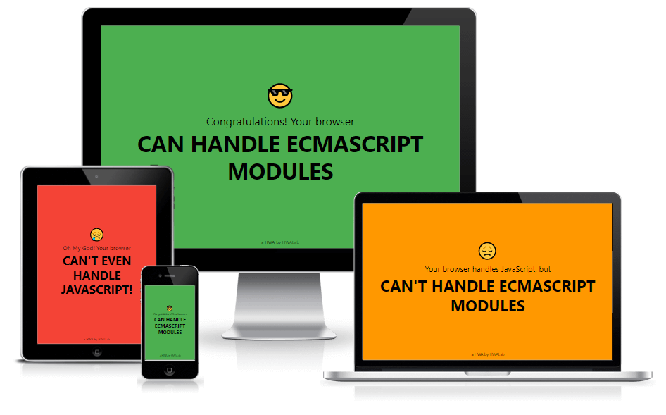

# HelloESM: Hello ECMAScript Modules
HelloESM is a HWA1 and a PWA2 that checks if your browser can handle ECMAScript Modules (aka native JavaScript modules).

1 Hello World App  
2 Progressive Web App  

## Contributions

Contributions are welcome! For feature requests and bug reports please [submit an issue](https://github.com/appliberated/helloesm/issues).

## Sponsor

HelloESM (and all Appliberated free apps and programs) are supported by [East-Tec](https://www.east-tec.com), the home of [east-tec Eraser](https://www.east-tec.com/eraser/), the privacy tool that quickly and securely covers your online and PC tracks.

## License

HelloESM is licensed under the [MIT License](LICENSE).
